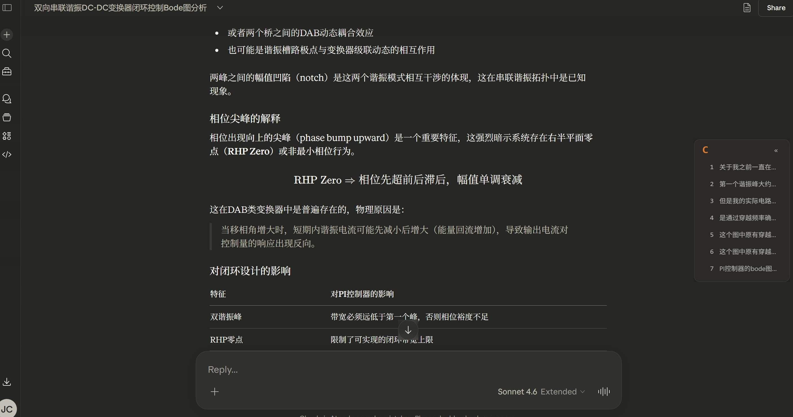
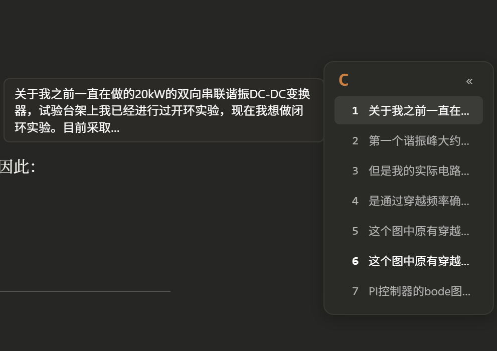
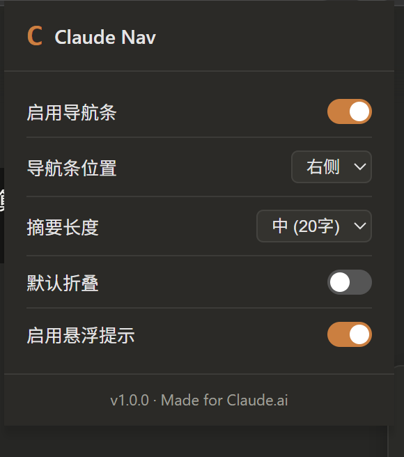
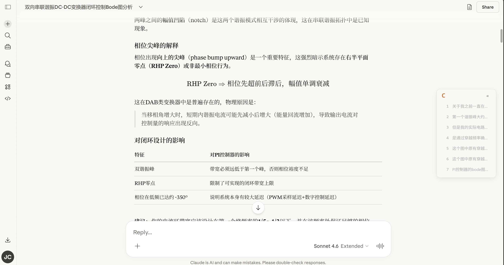

# Claude Nav

> 为 claude.ai 添加对话导航侧栏，让长对话也能秒速跳转。
> A conversation navigation sidebar for claude.ai — jump through long chats instantly.

[English](#english) · [中文](#中文)

---

## 中文

Claude Nav 是一个 Chrome 扩展，为 claude.ai 的对话页面右侧注入一个轻量导航条，把每一条用户提问列成可点击的时间线，方便回顾和跳转。

### 功能特性

- **节点导航**：点击任意节点平滑跳转到对应消息
- **高亮跟随**：滚动时自动高亮当前可见消息对应的节点
- **摘要预览**：悬停节点显示完整首行内容
- **主题适配**：自动跟随 claude.ai 深色 / 浅色主题
- **自定义设置**：位置、摘要长度、折叠状态、tooltip 等均可在 popup 中开关

<table>
  <tr>
    <td align="center"> <b>深色模式总览</b></td>
    <td align="center"> <b>悬浮提示与高亮</b></td>
  </tr>
  <tr>
    <td align="center"> <b>设置面板</b></td>
    <td align="center"> <b>浅色模式</b></td>
  </tr>
</table>

### 安装

1. `git clone` 本仓库
2. 打开 `chrome://extensions` 或 `edge://extensions`
3. 打开右上角「开发者模式」
4. 点击「加载已解压的扩展程序」，选择 `claude-nav` 文件夹
5. 打开任意 claude.ai 对话即可看到右侧导航条

### 设置项

| 设置项 | 默认值 | 说明 |
| --- | --- | --- |
| 启用导航条 | 开 | 总开关 |
| 导航条位置 | 右侧 | 右侧 / 左侧 |
| 摘要长度 | 中 (20字) | 短 / 中 / 长 |
| 默认折叠 | 关 | 打开页面时是否折叠 |
| 启用悬浮提示 | 开 | hover tooltip |

### Tech Stack

- Chrome Extension Manifest V3
- Vanilla JavaScript (no framework)
- Vanilla CSS

### License

MIT © Jinhao

---

## English

Claude Nav is a Chrome extension that injects a lightweight navigation sidebar into claude.ai conversation pages, listing every user prompt as a clickable timeline so you can review and jump around long chats in seconds.

### Features

- **Click to jump** — smooth scroll to any message in the conversation
- **Active highlight** — current visible message is auto-highlighted as you scroll
- **Summary preview** — hover any node to see the full first line
- **Theme aware** — follows claude.ai's dark / light mode automatically
- **Customizable** — position, summary length, default collapsed state, tooltip toggle, all in the popup

<table>
  <tr>
    <td align="center"> <b>Dark Mode Overview</b></td>
    <td align="center"> <b>Tooltip & Highlight</b></td>
  </tr>
  <tr>
    <td align="center"> <b>Settings Panel</b></td>
    <td align="center"> <b>Light Mode</b></td>
  </tr>
</table>

### Installation

1. `git clone` this repository
2. Open `chrome://extensions` or `edge://extensions`
3. Enable **Developer mode** in the top-right corner
4. Click **Load unpacked** and select the `claude-nav` folder
5. Open any claude.ai conversation — the sidebar should appear on the right

### Settings

| Setting | Default | Description |
| --- | --- | --- |
| Enable sidebar | On | Master switch |
| Position | Right | Right / Left |
| Summary length | Medium (20) | Short / Medium / Long |
| Default collapsed | Off | Whether the sidebar starts collapsed |
| Tooltip | On | Hover tooltip |

### Tech Stack

- Chrome Extension Manifest V3
- Vanilla JavaScript (no framework)
- Vanilla CSS

### License

MIT © Jinhao
